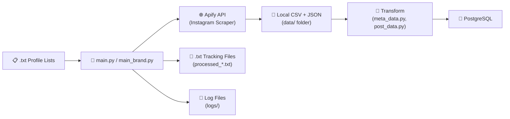
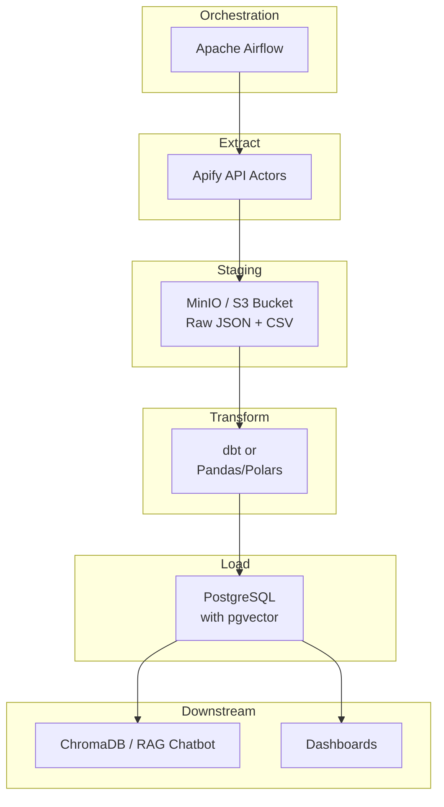

# UpClout ETL Pipeline — Analysis & Recommendations

## Overview

UpClout's ETL pipeline scrapes Instagram profile metadata and post data via the **Apify API**, transforms it (bio cleaning, location extraction, dtype correction), and loads it into a **PostgreSQL** database. The pipeline handles two entity types — **influencers** and **brands** — with separate entry points (`main.py` and `main_brand.py`).



---

## ✅ Pros — What's Working Well

### 1. Clear Separation of Concerns
The ETL phases are split into distinct modules: `extract.py`, `meta_data.py` (transform), `post_data.py` (transform + load), and `load.py`. Each file has a focused responsibility.

### 2. API Key Rotation
The `Apify` class rotates through **6 API tokens** to manage rate limits — a practical approach for sustained scraping.

### 3. Idempotency / Resume Support
The `processed_influencers.txt` and `processed_brands.txt` tracking files allow the pipeline to **skip already-processed profiles**, making reruns safe and resumable after crashes.

### 4. Comprehensive Logging
Every ETL phase has its own log file (`extract/`, `transform/`, `load/`, `api/`, `skipped_*.log`), providing traceability for debugging.

### 5. Rich Data Model
The schema captures influencers, brands, posts, hashtags, tagged users, and N:M junction tables (`posts_hashtags`, `posts_taggeduser`). The `rising_stars` and `reviews` tables suggest forward-thinking feature planning.

### 6. Conflict Handling on Inserts
`ON CONFLICT DO NOTHING` is used for posts, hashtags, and tagged users to gracefully handle duplicate inserts.

---

## ❌ Cons — Current Issues

### 1. Hardcoded Credentials & Configuration
```python
# load.py line 8
self.conn = psycopg2.connect(database="postgres", user="postgres", password=1040)

# post_data.py line 86
conn = psycopg2.connect(database="postgres", user="postgres", password=1040)
```
DB credentials are hardcoded in **4+ places** instead of using `.env`. The `.env` file exists but is only used for Apify tokens.

### 2. Heavy Code Duplication
`main.py` and `main_brand.py` are ~90% identical. `scrape_influencer()` and `scrape_brand()` in `extract.py` are the same function. `load_influencer_table()` and `load_brand_table()` differ only in the table name.

### 3. Relative Paths Fragility
Paths like `../../data`, `../../logs`, `../brand_profiles.txt` make the pipeline dependent on being run from `src/etl/`. If the working directory differs, everything breaks silently.

### 4. Per-Row Commits & Connection Leaks
```python
# load.py — every single INSERT commits individually
self.cur.execute(query, values)
self.conn.commit()  # for EACH row
```
Each post, hashtag, and tagged user triggers a separate `commit()`. For a profile with 50 posts × multiple hashtags, this produces **100+ commits per influencer**. The `handle_taggedUsers()` function also creates an entirely new Postgres connection per function call.

### 5. No Transaction / Rollback Safety
If the pipeline crashes mid-profile (e.g., meta_data loads but post_data fails), the database is left in a **partially-loaded state** with no rollback mechanism.

### 6. Unscoped Exception Handling
```python
except Exception as e:
    log.log_skipped_influencer(f"{influencer}Extract failed — {e}")
    continue
```
Broad `except Exception` swallows all errors. The recent `skipped_influencer.log` shows the same `log_message` variable bug hitting **17 profiles in a row** — all silently skipped.

### 7. Missing Data Validation
- No schema validation on Apify responses before inserting
- `get_post_data_dict()` assumes at least one JSON file exists and has `data[0]`
- `isPrivate()` doesn't return `False` in the else branch if the error key is present but doesn't match expected values (returns `None`)

### 8. Incomplete Features
- `handle_mentions()` — mostly `...` (not implemented)
- `handle_coauthors()` — entirely `...`
- `is_influencer()` — `...`
- `mentions_table` DDL exists but is never populated

### 9. Location Detection is Fragile
Location is extracted by keyword-matching the bio against 5 Pakistani cities. This misses most profiles and can false-positive (e.g., "Lahore food vlogs" in a non-Lahore account).

### 10. No Data Freshness Strategy
There's no mechanism to **re-scrape** an existing profile for updated follower counts or new posts. Once processed, a profile is skipped forever.

---

## 🏗️ Architecture Recommendations

### Short-Term Fixes (Do These First)

| Fix | Impact |
|-----|--------|
| Move **all DB credentials** to `.env` and load via `os.getenv()` | Security |
| **Batch commits**: accumulate inserts and commit once per profile | Performance (10-50x faster loads) |
| Replace relative paths with `pathlib.Path(__file__).parent` based resolution | Reliability |
| Fix the `log_message` unbound variable bug in `apify_class.py` `scrape_meta_data()` | 17+ profiles currently failing |
| Add `isPrivate()` explicit `return False` in the else-else branch | Silent bugs |
| Wrap each profile's full ETL in a **single transaction** with rollback on error | Data integrity |

### Medium-Term Refactors

| Refactor | Benefit |
|----------|---------|
| Merge `main.py` / `main_brand.py` into one parameterized pipeline with an `entity_type` argument | Eliminate duplication |
| Use Python's `logging` module (with handlers, levels, formatters) instead of custom `log.py` | Structured logging, configurable verbosity |
| Add **JSON schema validation** (e.g., `pydantic` models) for Apify responses before DB insert | Catch API changes early |
| Use **connection pooling** (`psycopg2.pool`) or a single shared connection passed through the pipeline | Stop creating new connections in `handle_taggedUsers()` and `mention_exists()` |

---

## 🚀 Technology Stack Recommendations

### For a Production-Grade Pipeline



### Recommended Stack Breakdown

| Layer | Current | Recommended | Why |
|-------|---------|-------------|-----|
| **Orchestration** | Manual `python main.py` | **Apache Airflow** | Scheduled DAGs, retry logic, dependency graphs, monitoring UI. You already have Airflow experience from past projects. |
| **Extract** | Apify Python SDK | **Keep Apify**, but add a retry wrapper with exponential backoff | Apify is solid for Instagram; just improve resilience |
| **Staging** | Local `data/` folder | **S3/MinIO bucket** or at minimum a structured `data/raw/{date}/{username}/` layout | Decouple extract from transform; enable reprocessing |
| **Transform** | Pandas in-pipeline | **dbt** (SQL transforms) or **Polars** (faster in-memory) | dbt gives you version-controlled, testable transformations. Polars is 5-10x faster than Pandas for your data scale. |
| **Load** | Raw psycopg2 `INSERT` | **SQLAlchemy** + **`COPY FROM`** bulk loads | Bulk loading is orders of magnitude faster than row-by-row inserts |
| **Tracking** | `.txt` files | **Airflow XCom** or a `pipeline_runs` DB table | Database-backed state is queryable and reliable |
| **Logging** | Custom `log.py` | Python `logging` module → **structured JSON logs** | Parseable, filterable, integrates with log aggregators |
| **Config** | Hardcoded + `.env` | **Pydantic Settings** | Type-safe, validated config with `.env` support |

### Batch vs. Streaming?

**Batch** is the right choice for your use case:
- Instagram profile data doesn't need real-time refresh
- Apify actors are inherently batch-oriented (run → collect → done)
- Your data volume (~500 profiles × 50 posts = ~25K rows) is well within batch territory
- Streaming (Kafka, Flink) would add massive operational overhead with no benefit

> [!TIP]
> A good cadence would be: **daily DAG** for new profiles, **weekly DAG** for re-scraping existing profiles to update follower counts and ingest new posts.

### PySpark?

**Not necessary** at your current scale. PySpark shines at 1M+ rows or when you need distributed computing. Your dataset is small enough that Pandas/Polars on a single machine handles everything comfortably. Revisit if you scale to 50K+ profiles.

---

## 📋 Suggested Pipeline Architecture with Airflow

```python
# Pseudocode — Airflow DAG structure
@dag(schedule="@daily", catchup=False)
def upclout_etl():

    @task
    def get_profiles() -> list[str]:
        """Read from DB or txt, filter already_processed"""
        ...

    @task
    def extract(username: str) -> str:
        """Scrape via Apify → S3 staging"""
        ...

    @task
    def transform(raw_path: str) -> dict:
        """Clean bio, extract location, validate schema"""
        ...

    @task
    def load(clean_data: dict):
        """Bulk insert to Postgres with transaction"""
        ...

    profiles = get_profiles()
    for profile in profiles:
        raw = extract(profile)
        clean = transform(raw)
        load(clean)
```

Each task is independently retriable. If `transform` fails for one profile, only that profile retries — others continue.

---

## 🔑 Key Takeaways

1. **Your foundation is solid** — the data model, API rotation, and resume capability show good engineering instincts
2. **The biggest wins** come from fixing the DB interaction pattern (batch commits, connection reuse, transactions)
3. **Airflow is the natural next step** — it replaces your manual `break` at `count == 20`, retry logic, and scheduling
4. **Don't over-engineer** — skip Kafka/Spark/streaming. Batch + Airflow + Postgres handles your scale perfectly
5. **Deduplication matters** — your `insta_profiles.txt` has the same usernames appearing across influencer and brand lists; consider a unified registry

---

*Analysis generated on 2026-03-25 based on full codebase review of the UpClout project.*
